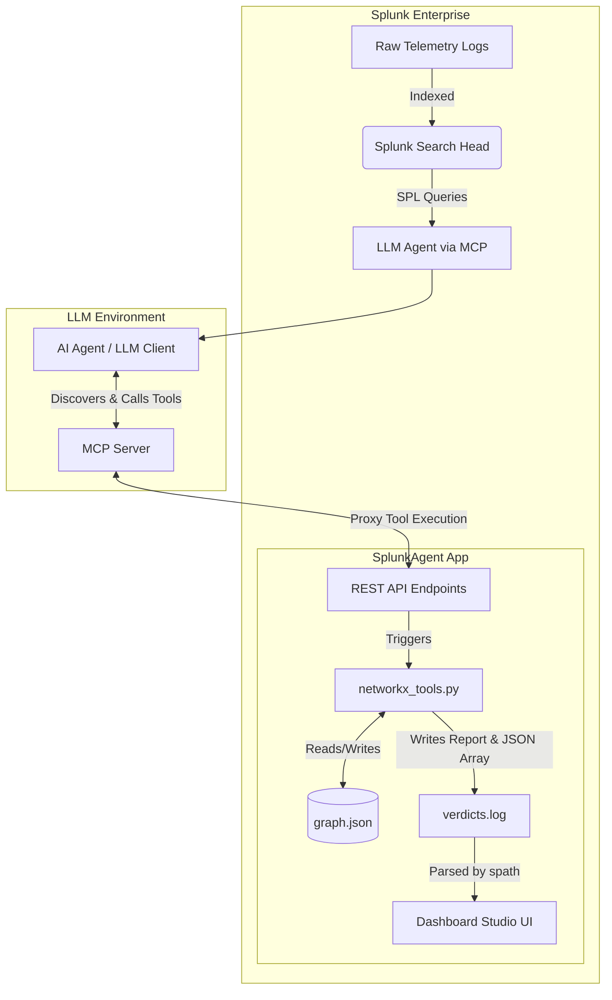
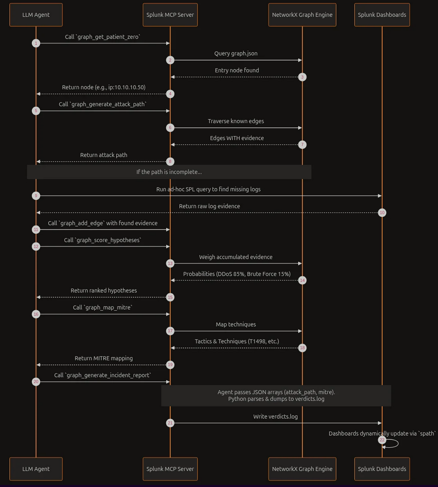

# Splunk AttackGraph AI Agent

The **Splunk AttackGraph AI Agent** is a state-of-the-art autonomous cybersecurity agent seamlessly integrated into Splunk via the **Model Context Protocol (MCP)**. 

When security alerts are triggered in Splunk, this app automatically parses the telemetry, extracts critical entities (users, IPs, hosts), and builds a dynamic, in-memory attack graph using `NetworkX`. An LLM-powered AI Agent then uses this graph to autonomously investigate the incident, identify Patient Zero, map the attack to the MITRE ATT&CK framework, and generate comprehensive incident reports natively inside Splunk dashboards.

---

## Architecture Diagram

The system operates using a decoupled MCP architecture, where Splunk itself acts as the tool provider for the AI agent.





---

## Agent Standard Operating Procedure (SOP)

The AI Agent is strictly instructed to follow a 7-step playbook for every investigation:

1. **Historical Context Check:** `graph_get_historical_investigations` to see if the entity has been convicted in the past to avoid redundant work.
2. **Patient Zero Identification:** `graph_get_patient_zero` to find the root compromised node (in-degree 0).
3. **Graph Traversal & Expansion:** `graph_generate_attack_path` to build the timeline. If evidence is missing, the AI writes SPL to hunt for more logs and injects them dynamically using `graph_add_edge`.
4. **MITRE ATT&CK Mapping:** `graph_map_mitre` to map the highest-scoring attack hypothesis to MITRE tactics and techniques.
5. **Draft Executive Summary:** Synthesize the findings into a concise 2-sentence summary.
6. **Generate Incident Report:** `graph_generate_incident_report` to write the final Verdict, Timeline, and JSON/Markdown payload to the Splunk App's static directory.
7. **Clean up Graph Context:** `graph_reset` to completely wipe the current graph memory, ensuring the state is clean for the next incoming alert.

---

## Setup & Configuration

### 1. Environment Configuration
For the local test scripts and MCP authentication to work, you must create a `.env` file in the root of the app (`$SPLUNK_HOME/etc/apps/SplunkAgent/.env`) with your Splunk administrator credentials.

Create the `.env` file:
```ini
SPLUNK_USERNAME='admin'
SPLUNK_PASSWORD='your_password'
```

### 2. Register MCP Tools
The tools need to be registered with the Splunk MCP Server. The script dynamically reads from your `.env` file to authenticate.
```bash
python bin/register_tools.py
```

> **Important:** Newly registered tools are **disabled by default**. After running the script, open the Splunk MCP Server app UI and enable each tool — until you do, the agent will not see them in tool discovery.

### 3. Restart Splunk
If you modify `restmap.conf` or the names of the backend handlers (like `mcp_handler.py`), you must restart Splunk so it can reload the REST endpoints.
```bash
# Windows
& "c:\Program Files\Splunk\bin\splunk.exe" restart

# Linux
$SPLUNK_HOME/bin/splunk restart
```

---

## Running the Tests

The `bin/test/` directory contains 14 individual test scripts to independently verify every MCP graph tool. You can run these using either Splunk's embedded Python (recommended, requires no setup) or a standard Python Virtual Environment.

### Windows

**Option A: Using Splunk's Built-in Python (Recommended)**
*No `venv` required. Splunk already ships with the necessary dependencies.*
```powershell
& "c:\Program Files\Splunk\bin\splunk.exe" cmd python .\bin\test\test_mcp_graph_reset.py
```

**Option B: Using a Virtual Environment (venv)**
```powershell
# Create and activate venv
python -m venv venv
.\venv\Scripts\Activate

# Install lightweight requirements (python-dotenv, httpx, requests, networkx)
pip install -r requirements.txt

# Run the test
python .\bin\test\test_mcp_graph_reset.py
```

---

### Linux / macOS

**Option A: Using Splunk's Built-in Python (Recommended)**
```bash
$SPLUNK_HOME/bin/splunk cmd python ./bin/test/test_mcp_graph_reset.py
```

**Option B: Using a Virtual Environment (venv)**
```bash
# Create and activate venv
python3 -m venv venv
source venv/bin/activate

# Install dependencies
pip install -r requirements.txt

# Run the test
python ./bin/test/test_mcp_graph_reset.py
```

---

## Troubleshooting

Most issues are environmental (Splunk not running, tools not registered, missing `.env`) rather than code bugs. Work through the checks below before assuming a regression.

### Tests fail with connection errors
*Symptoms:* `ConnectionRefusedError`, `Max retries exceeded`, or `SSL` errors when running anything under `bin/test/`.
- Verify Splunk is running: `$SPLUNK_HOME/bin/splunk status`.
- Confirm the REST port is reachable: `curl -k https://127.0.0.1:8089/services/server/info`.
- The local REST endpoint uses a self-signed cert — tests intentionally pass `verify=False`. Do not point them at a remote Splunk instance.

### Tests fail with `401 Unauthorized` or `Authentication failed`
- Ensure `.env` exists at the app root (`$SPLUNK_HOME/etc/apps/SplunkAgent/.env`) with valid `SPLUNK_USERNAME` and `SPLUNK_PASSWORD`.
- The file is loaded by `python-dotenv`; if you ran the test from a different working directory, run it from the app root.

### Tool call returns `Unknown action` or `404 Not Found`
- The MCP tool schemas are out of date. Re-run `python bin/register_tools.py` to push the latest schemas to the Splunk MCP server.
- After re-registering, open the Splunk MCP Server app UI and **enable** any newly registered tools — they are disabled by default and will not appear in agent tool discovery until enabled.
- Confirm the tool name you are calling is app-namespaced, e.g. `SplunkAgent_graph_reset`, not `graph_reset`.
- If you added a new action, verify the matching `elif action == '<name>':` branch exists in [bin/mcp_handler.py](bin/mcp_handler.py).

### Changes to `restmap.conf` or handler classes aren't picked up
- Splunk caches REST endpoint handlers at startup. Restart Splunk after editing `restmap.conf` or renaming any handler file/class: `$SPLUNK_HOME/bin/splunk restart`.
- New `action` branches inside an existing handler do **not** require a restart.

### Investigation results look stale or contaminated
- The graph is persisted to `bin/tools/graph.json` between runs. Leftover nodes/edges from previous incidents will skew patient-zero and attack-path output.
- Call `graph_reset` (SOP step 7) to wipe state before re-running an investigation.

### Alert fires but no nodes appear in the graph
- Confirm the saved search in [default/savedsearches.conf](default/savedsearches.conf) is enabled and the `seed_graph` alert action is attached.
- Check `$SPLUNK_HOME/var/log/splunk/python.log` and `splunkd.log` for stack traces from [bin/seed_graph.py](bin/seed_graph.py).
- Verify the alert's `attack_type` field matches a handler in [bin/seed_handlers/](bin/seed_handlers/).
- Edges emitted by the handler **must** carry an `evidence` tag — scoring and attack-path traversal ignore untagged edges.

### Reports don't show up in the dashboard
- Reports are written to [appserver/static/reports/](appserver/static/reports/) along with `index.json`. Confirm both the new `IR-*.json`/`.md` files and the updated `index.json` were created.
- The dashboard serves them from `/en-US/static/app/SplunkAgent/reports/`. A hard refresh of the browser may be required.

### `ImportError: No module named networkx` (or `pytz`)
- Splunk's bundled Python imports vendored copies from `bin/networkx/` and `bin/pytz/`. Do not delete these directories — `pip` is not available in the Splunk runtime.
- The two `networkx-*.dist-info` folders (3.2.1 and 3.6.1) coexisting is harmless.

### Object arguments arrive as strings in a tool
- MCP variable substitution sometimes delivers object-typed parameters (`properties`, `verdict`, `mitre`, `attack_path`, `all_hypotheses`) as JSON or Python-literal strings.
- Follow the existing pattern in [bin/tools/tools.py](bin/tools/tools.py): try `json.loads`, then fall back to `ast.literal_eval`. Any new object-typed parameter must do the same.

---
