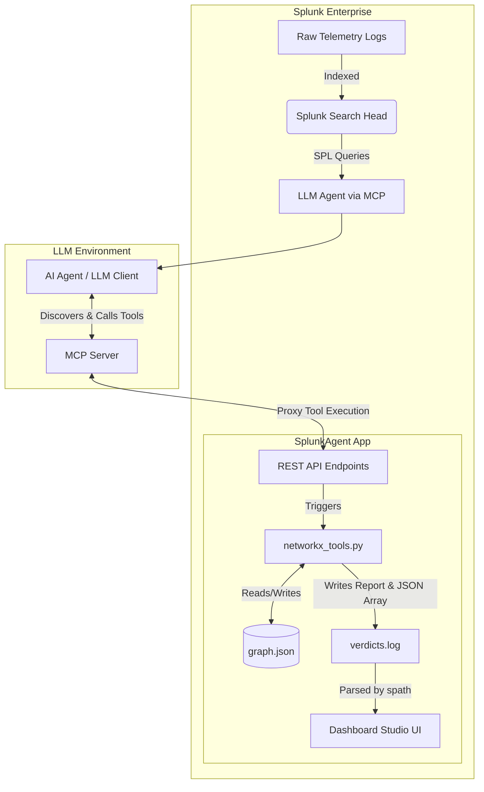

# Splunk AttackGraph AI Agent

The **Splunk AttackGraph AI Agent** is a state-of-the-art autonomous cybersecurity agent seamlessly integrated into Splunk via the **Model Context Protocol (MCP)**. 

When security alerts are triggered in Splunk, this app automatically parses the telemetry, extracts critical entities (users, IPs, hosts), and builds a dynamic, in-memory attack graph using `NetworkX`. An LLM-powered AI Agent then uses this graph to autonomously investigate the incident, identify Patient Zero, map the attack to the MITRE ATT&CK framework, and generate comprehensive incident reports natively inside Splunk dashboards.

---

## Architecture Diagram

The system operates using a decoupled MCP architecture, where Splunk itself acts as the tool provider for the AI agent.




---

## Agent Standard Operating Procedure (SOP)

The AI Agent is strictly instructed to follow a 7-step playbook for every investigation:

1. **Historical Context Check:** `graph_get_historical_investigations` to see if the entity has been convicted in the past to avoid redundant work.
2. **Patient Zero Identification:** `graph_get_patient_zero` to find the root compromised node (in-degree 0).
3. **Graph Traversal & Expansion:** `graph_generate_attack_path` to build the timeline. If evidence is missing, the AI writes SPL to hunt for more logs and injects them dynamically using `graph_add_edge`.
4. **MITRE ATT&CK Mapping:** `graph_map_mitre` to map the highest-scoring attack hypothesis to MITRE tactics and techniques.
5. **Draft Executive Summary:** Synthesize the findings into a concise 2-sentence summary.
6. **Generate Incident Report:** `graph_generate_incident_report` to write the final Verdict, Timeline, and JSON/Markdown payload to the Splunk App's static directory.
7. **Clean up Graph Context:** `graph_reset` to completely wipe the current graph memory, ensuring the state is clean for the next incoming alert.

---

## Setup & Configuration

### 1. Environment Configuration
For the local test scripts and MCP authentication to work, you must create a `.env` file in the root of the app (`$SPLUNK_HOME/etc/apps/SplunkAgent/.env`) with your Splunk administrator credentials.

Create the `.env` file:
```ini
SPLUNK_USERNAME='admin'
SPLUNK_PASSWORD='your_password'
```

### 2. Register MCP Tools
The tools need to be registered with the Splunk MCP Server. The script dynamically reads from your `.env` file to authenticate.
```bash
python bin/register_tools.py
```

### 3. Restart Splunk
If you modify `restmap.conf` or the names of the backend handlers (like `mcp_handler.py`), you must restart Splunk so it can reload the REST endpoints.
```bash
# Windows
& "c:\Program Files\Splunk\bin\splunk.exe" restart

# Linux
$SPLUNK_HOME/bin/splunk restart
```

---

## Running the Tests

The `bin/test/` directory contains 14 individual test scripts to independently verify every MCP graph tool. You can run these using either Splunk's embedded Python (recommended, requires no setup) or a standard Python Virtual Environment.

### Windows

**Option A: Using Splunk's Built-in Python (Recommended)**
*No `venv` required. Splunk already ships with the necessary dependencies.*
```powershell
& "c:\Program Files\Splunk\bin\splunk.exe" cmd python .\bin\test\test_mcp_graph_reset.py
```

**Option B: Using a Virtual Environment (venv)**
```powershell
# Create and activate venv
python -m venv venv
.\venv\Scripts\Activate

# Install lightweight requirements (python-dotenv, httpx, requests, networkx)
pip install -r requirements.txt

# Run the test
python .\bin\test\test_mcp_graph_reset.py
```

---

### Linux / macOS

**Option A: Using Splunk's Built-in Python (Recommended)**
```bash
$SPLUNK_HOME/bin/splunk cmd python ./bin/test/test_mcp_graph_reset.py
```

**Option B: Using a Virtual Environment (venv)**
```bash
# Create and activate venv
python3 -m venv venv
source venv/bin/activate

# Install dependencies
pip install -r requirements.txt

# Run the test
python ./bin/test/test_mcp_graph_reset.py
```
